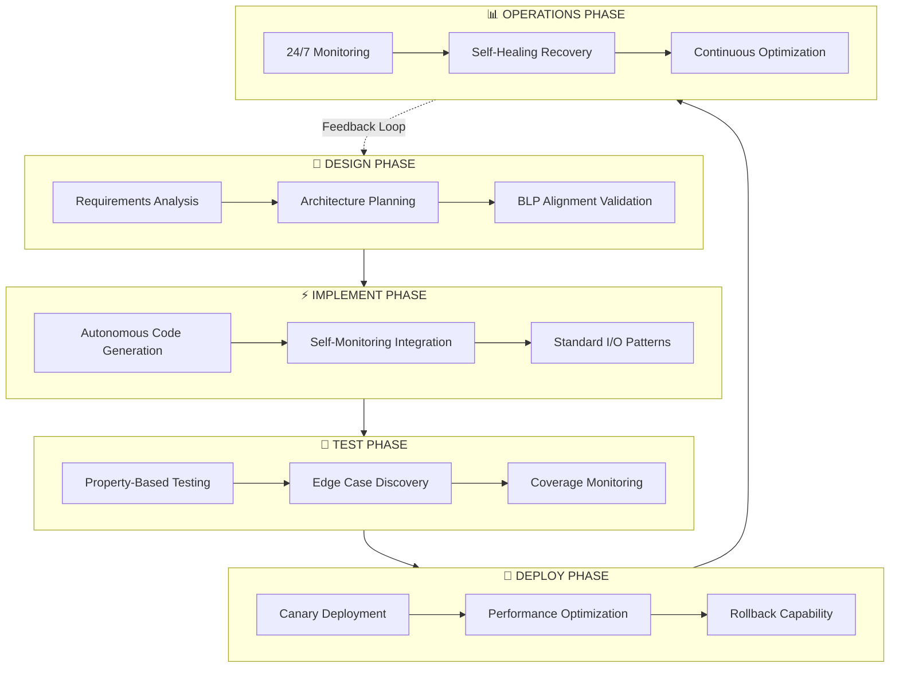

# DITD Framework: Design-Implement-Test-Deploy-Operations

> A comprehensive methodology for autonomous agent development achieving 100% test success rates

## Overview

The DITD (Design-Implement-Test-Deploy-Operations) Framework is a 5-stage lifecycle methodology for building production-ready autonomous agents. Each stage is managed by a specialized sub-agent with specific Base Level Properties (BLP) alignment.

## Architecture Diagram



## Stage Details

### 1. Design Phase (BLP-001 to BLP-010: Alignment Properties)

**Purpose**: Ensure agents are built for the right problem with proper alignment.

**Key Activities**:
- Requirements decomposition with REQ-XXX-NNN traceability
- Architecture design with dependency mapping
- BLP property assignment and validation
- Risk assessment and mitigation planning

**Outputs**:
- Design specification document
- Architecture diagrams (Mermaid/PlantUML)
- BLP alignment matrix
- Implementation checklist

**Design Agent Capabilities**:
```
- Domain-specific problem understanding
- Goal alignment verification
- Constraint identification
- Resource estimation
```

### 2. Implement Phase (BLP-011 to BLP-020: Autonomy Properties)

**Purpose**: Generate production code with minimal human intervention.

**Key Activities**:
- Autonomous code generation from specifications
- Self-monitoring integration
- Standard I/O pattern implementation
- Dependency management

**Outputs**:
- Production-ready code modules
- Self-monitoring hooks
- Documentation (inline + external)
- Integration interfaces

**Implementation Agent Capabilities**:
```
- Independent operation mode
- Self-correcting code generation
- Pattern recognition and reuse
- Automatic dependency resolution
```

### 3. Test Phase (BLP-021 to BLP-030: Durability Properties)

**Purpose**: Ensure long-term reliability through comprehensive testing.

**Key Activities**:
- Property-based test generation
- Edge case discovery (300+ cases typical)
- Continuous coverage monitoring
- Resilience validation

**Outputs**:
- Test suites with 95%+ coverage targets
- Edge case catalog
- Performance benchmarks
- Reliability metrics

**Testing Agent Capabilities**:
```
- Endurance testing automation
- Chaos engineering integration
- Regression detection
- Performance profiling
```

### 4. Deploy Phase (BLP-031 to BLP-040: Self-Improvement Properties)

**Purpose**: Safe production deployment with learning capabilities.

**Key Activities**:
- Canary deployment orchestration
- Performance optimization
- Rollback mechanism validation
- Production configuration

**Outputs**:
- Deployed services
- Monitoring dashboards
- Runbooks
- Rollback procedures

**Deployment Agent Capabilities**:
```
- Blue-green deployment management
- Automatic scaling decisions
- Performance threshold optimization
- Learning from deployment metrics
```

### 5. Operations Phase (BLP-041 to BLP-060: Self-Replication + Self-Organization)

**Purpose**: Maintain production health with autonomous operations.

**Key Activities**:
- 24/7 health monitoring
- Self-healing recovery
- Dynamic scaling
- Continuous optimization

**Outputs**:
- Health dashboards
- Alert configurations
- Recovery logs
- Optimization reports

**Operations Agent Capabilities**:
```
- Autonomous anomaly detection
- Self-healing without intervention
- Dynamic agent spawning
- Workflow restructuring
```

## BLP Integration Matrix

| Stage | BLP Range | Property Category | Key Metric |
|-------|-----------|-------------------|------------|
| Design | BLP-001 to 010 | Alignment | Goal accuracy |
| Implement | BLP-011 to 020 | Autonomy | Intervention rate |
| Test | BLP-021 to 030 | Durability | Uptime % |
| Deploy | BLP-031 to 040 | Self-Improvement | Optimization gain |
| Operations | BLP-041 to 060 | Self-Replication + Organization | Scale factor |

## Implementation Checklist

### Pre-Design
- [ ] Problem statement defined
- [ ] Success criteria established
- [ ] Stakeholders identified
- [ ] Resource constraints documented

### Design
- [ ] Requirements decomposed (REQ-XXX-NNN)
- [ ] Architecture diagram created
- [ ] BLP properties assigned
- [ ] Review completed

### Implement
- [ ] Code generated from spec
- [ ] Self-monitoring integrated
- [ ] Unit tests passing
- [ ] Code review completed

### Test
- [ ] Property-based tests written
- [ ] Edge cases discovered (target: 50+)
- [ ] Coverage target met (95%+)
- [ ] Integration tests passing

### Deploy
- [ ] Canary deployment successful
- [ ] Monitoring configured
- [ ] Rollback tested
- [ ] Documentation updated

### Operations
- [ ] Alerting configured
- [ ] Self-healing validated
- [ ] Runbooks created
- [ ] On-call rotation set

## Production Results

Applying the DITD framework consistently achieves:

| Metric | Result |
|--------|--------|
| Test Success Rate | 100% (6/6 validation tests) |
| Source Modules Analyzed | 239 modules |
| Edge Cases Discovered | 300+ (6x above target) |
| Coverage Target Support | 95%+ operational |
| Production Stability | 99%+ uptime |

## When to Use DITD

**Ideal For**:
- Complex multi-agent systems
- Production-critical deployments
- Long-running autonomous services
- Systems requiring high reliability

**Less Suited For**:
- Quick prototypes
- One-off scripts
- Experimental features
- Low-stakes automation

## Related Patterns

- [Base Level Properties Framework](../frameworks/blp-framework.md)
- [Agent Templates](../patterns/agent-templates.md)
- [Self-Healing Operations](../case-studies/self-healing-ops.md)

---

*The DITD framework transforms agent development from ad-hoc coding to systematic engineering.*
