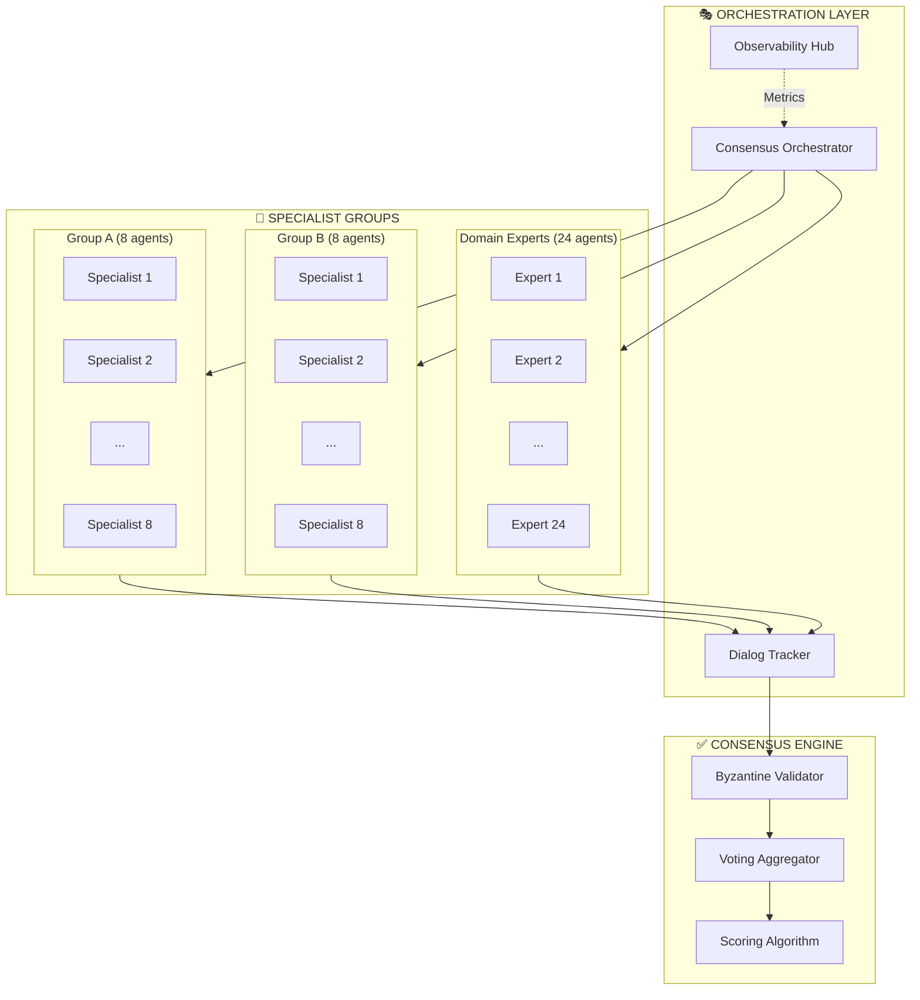

# Multi-Agent Consensus Architecture

> 40 specialized agents achieving 87.4% consensus through structured collaboration

## Overview

The Multi-Agent Consensus Architecture enables large-scale collaborative decision-making across specialized AI agents. This pattern achieves high agreement rates while maintaining diversity of perspective through structured debate protocols and Byzantine consensus validation.

## System Topology



## Consensus Mechanism

### Phase 1: Topic Distribution
The orchestrator broadcasts the topic to all 40 agents simultaneously:
- Each agent receives identical context
- Agents begin independent analysis
- No inter-agent communication yet

### Phase 2: Initial Proposals
Each agent generates their initial proposal:
- Structured response format
- Confidence score (0.0 - 1.0)
- Supporting rationale
- Source citations (if applicable)

### Phase 3: Inter-Agent Dialog
Agents engage in structured debates:
- Round-robin dialog exchanges
- Challenge-response protocols
- Evidence sharing
- Position refinement

**Dialog Exchange Format**:
```json
{
  "exchange_id": "dialog_001",
  "from_agent": "specialist_a1",
  "to_agent": "expert_d12",
  "type": "challenge",
  "content": "...",
  "confidence": 0.85,
  "evidence": ["source1", "source2"]
}
```

### Phase 4: Byzantine Consensus
All proposals pass through Byzantine validation:
- 3+ validators required
- 67% threshold for agreement
- Suspicious patterns rejected
- Anti-persuasion defenses active

### Phase 5: Final Scoring
Weighted consensus calculation:
```
Final Score = Σ(agent_confidence × specialty_weight × peer_validation)
             ────────────────────────────────────────────────────────
                              total_participating_agents
```

## Agent Specialization

| Group | Count | Specialty | Weight Bonus |
|-------|-------|-----------|--------------|
| Group A | 8 | Domain expertise (stories, narratives) | +15% |
| Group B | 8 | Domain expertise (observations, analysis) | +15% |
| Experts | 24 | Cross-domain validation | +5% |

## Dialog Tracking

The system tracks all inter-agent communications:

**Metrics Captured**:
- Total exchanges: 306+ per consensus round
- Challenge rate: % of proposals challenged
- Resolution rate: % of challenges resolved
- Influence score: Which agents shift others' positions

**Traceability**:
```
Source Tool Call → Agent Discussion → Peer Review → Final Consensus
     ↓                    ↓                ↓              ↓
  Logged             Logged           Logged         Logged
```

## Security Features

### Byzantine Consensus Validation
- Prevents single-agent manipulation
- Requires supermajority agreement
- Rejects statistically anomalous votes

### Anti-Persuasion Defenses
- Pattern deviation detection (30% threshold)
- Suspicious keyword filtering
- Rate limiting on position changes

### Audit Trail
- All exchanges logged with timestamps
- Agent identity verification
- Tamper-evident logging

## Production Results

| Metric | Value |
|--------|-------|
| Total Agents | 40 specialized |
| Consensus Rate | 87.4% agreement |
| Dialog Exchanges | 306 tracked |
| Byzantine Threshold | 67% |
| Processing Time | < 60 seconds |

## Implementation Patterns

### Agent Registration
```python
# Each agent registers with the orchestrator
agent_registry = {
    "agent_id": "specialist_a1",
    "specialty": "narrative_analysis",
    "group": "group_a",
    "weight": 1.15,  # +15% specialty bonus
    "capabilities": ["challenge", "propose", "validate"]
}
```

### Consensus Trigger
```python
# Orchestrator initiates consensus round
consensus_request = {
    "topic": "...",
    "required_quorum": 0.8,  # 80% participation minimum
    "timeout_seconds": 120,
    "rounds": 3
}
```

### Result Aggregation
```python
# Final consensus result
consensus_result = {
    "topic_id": "...",
    "final_score": 0.874,
    "participating_agents": 40,
    "dialog_exchanges": 306,
    "consensus_achieved": True,
    "dissenting_agents": ["agent_12", "agent_37"],
    "validation": "byzantine_passed"
}
```

## When to Use This Pattern

**Ideal For**:
- High-stakes decisions requiring diverse perspectives
- Complex problems with multiple valid approaches
- Quality assurance through peer review
- Collaborative content generation

**Less Suited For**:
- Simple, deterministic tasks
- Latency-critical operations (< 1 second)
- Tasks with single correct answers
- Low-value decisions

## Scaling Considerations

| Agent Count | Exchanges | Latency | Consensus Quality |
|-------------|-----------|---------|-------------------|
| 10 | ~50 | 15s | Good (75%+) |
| 20 | ~120 | 30s | Better (80%+) |
| 40 | ~300 | 60s | Excellent (85%+) |
| 100 | ~1000 | 180s | Optimal (90%+) |

## Related Architectures

- [DITD Framework](ditd-framework.md)
- [Nano-Agent Networks](nano-agent-networks.md)
- [Self-Healing Operations](../case-studies/self-healing-ops.md)

---

*Multi-agent consensus transforms AI from individual decision-making to collaborative intelligence.*
