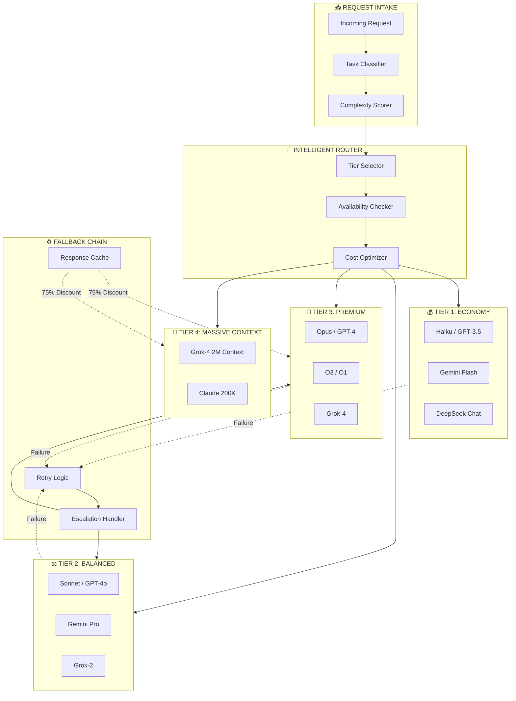

# Nano-Agent Networks: Intelligent Fallback Chains

> Achieving 79-83% cost reduction through tiered agent routing

## Overview

Nano-Agent Networks implement intelligent fallback chains that route tasks to the most cost-effective agent capable of completing them. This architecture achieves significant cost savings while maintaining quality through automatic escalation and retry mechanisms.

## Architecture Diagram



## Tier Classification

### Tier 1: Economy (Simple Tasks)
**Cost**: $0.25 - $0.80 per 1M tokens
**Use Cases**:
- Text formatting and cleanup
- Simple data extraction
- Basic summarization
- Template-based generation

**Models**:
| Model | Provider | Strength |
|-------|----------|----------|
| Haiku | Anthropic | Fast, reliable |
| GPT-3.5 Turbo | OpenAI | Broad capability |
| Gemini Flash | Google | Low latency |
| DeepSeek Chat | DeepSeek | Cost-effective |

### Tier 2: Balanced (Standard Tasks)
**Cost**: $2 - $10 per 1M tokens
**Use Cases**:
- Code generation and review
- Complex summarization
- Multi-step reasoning
- API integration

**Models**:
| Model | Provider | Strength |
|-------|----------|----------|
| Sonnet 4 | Anthropic | Balanced performance |
| GPT-4o | OpenAI | Multimodal |
| Gemini Pro | Google | Long context |
| Grok-2 | XAI | Speed + quality |

### Tier 3: Premium (Complex Tasks)
**Cost**: $10 - $75 per 1M tokens
**Use Cases**:
- Architecture design
- Complex debugging
- Research synthesis
- Critical decision support

**Models**:
| Model | Provider | Strength |
|-------|----------|----------|
| Opus 4 | Anthropic | Highest capability |
| GPT-4 | OpenAI | Proven reliability |
| O3/O1 | OpenAI | Reasoning tasks |
| Grok-4 | XAI | Extended thinking |

### Tier 4: Massive Context (Large Codebases)
**Cost**: $15 - $30 per 1M tokens (with caching: 75% discount)
**Use Cases**:
- Full codebase analysis
- Large document processing
- Repository-wide refactoring
- Comprehensive audits

**Models**:
| Model | Context Window | Provider |
|-------|----------------|----------|
| Grok-4 | 2M tokens | XAI |
| Claude | 200K tokens | Anthropic |

## Complexity Scoring

Tasks are scored on multiple dimensions:

```python
complexity_score = (
    token_count_factor * 0.2 +
    reasoning_depth * 0.3 +
    domain_specificity * 0.2 +
    accuracy_requirement * 0.2 +
    latency_requirement * 0.1
)

# Score ranges:
# 0.0 - 0.3: Tier 1 (Economy)
# 0.3 - 0.6: Tier 2 (Balanced)
# 0.6 - 0.8: Tier 3 (Premium)
# 0.8 - 1.0: Tier 4 (Massive Context)
```

## Fallback Chain Logic

### Retry Strategy
```
1. Initial attempt: Selected tier
2. First retry: Same tier, different model
3. Second retry: Next tier up
4. Final attempt: Premium tier with extended timeout
```

### Escalation Triggers
- Token limit exceeded
- Quality threshold not met
- Timeout exceeded
- Model unavailable

### De-escalation (Cost Optimization)
- Simple follow-up questions route to lower tier
- Cached responses reused (75% discount)
- Batch similar requests for efficiency

## Cost Optimization Results

| Scenario | Before | After | Savings |
|----------|--------|-------|---------|
| General queries | Tier 3 default | Tiered routing | 79% |
| Code review | Tier 3 always | Tier 2 + fallback | 65% |
| Summarization | Tier 2 default | Tier 1 first | 83% |
| Complex research | Tier 3 only | Tier 3 + cache | 75% |

**Overall Average Savings**: 79-83% cost reduction

## Caching Strategy

### Request-Level Cache
- Hash request content
- 15-minute TTL for identical queries
- Cross-session cache sharing

### Provider-Level Cache
- XAI/Grok: 75% cache discount on prompt caching
- Anthropic: Prompt caching for repeated prefixes
- OpenAI: Batch API for non-urgent requests

### Response Reuse
```python
cache_key = hash(
    task_type +
    normalized_content +
    output_format
)
# Check cache before routing to any tier
```

## Implementation Pattern

### Router Configuration
```yaml
routing_rules:
  - pattern: "summarize|format|extract"
    tier: 1
    fallback_tier: 2

  - pattern: "code|implement|debug"
    tier: 2
    fallback_tier: 3

  - pattern: "architecture|design|critical"
    tier: 3
    fallback_tier: 3  # No fallback, retry same tier

  - pattern: "codebase|repository|full analysis"
    tier: 4
    use_cache: true
```

### Health Monitoring
```python
provider_health = {
    "anthropic": {"status": "healthy", "latency_p95": 2.3},
    "openai": {"status": "healthy", "latency_p95": 1.8},
    "xai": {"status": "healthy", "latency_p95": 1.2},
    "google": {"status": "degraded", "latency_p95": 5.1}
}
# Route away from degraded providers
```

## Production Metrics

| Metric | Value |
|--------|-------|
| Tier 1 Usage | 45% of requests |
| Tier 2 Usage | 35% of requests |
| Tier 3 Usage | 15% of requests |
| Tier 4 Usage | 5% of requests |
| Fallback Rate | 8% |
| Cache Hit Rate | 32% |
| Average Latency | 2.1 seconds |

## When to Use This Pattern

**Ideal For**:
- High-volume production systems
- Cost-sensitive deployments
- Diverse task portfolios
- Systems requiring reliability

**Less Suited For**:
- Single-model deployments
- Research/experimentation
- Consistent premium requirements
- Latency-critical (< 500ms)

## Related Patterns

- [DITD Framework](ditd-framework.md)
- [Multi-Agent Consensus](multi-agent-consensus.md)
- [MCP Orchestration](../patterns/mcp-orchestration.md)

---

*Nano-agent networks prove that intelligent routing beats brute-force premium models.*
