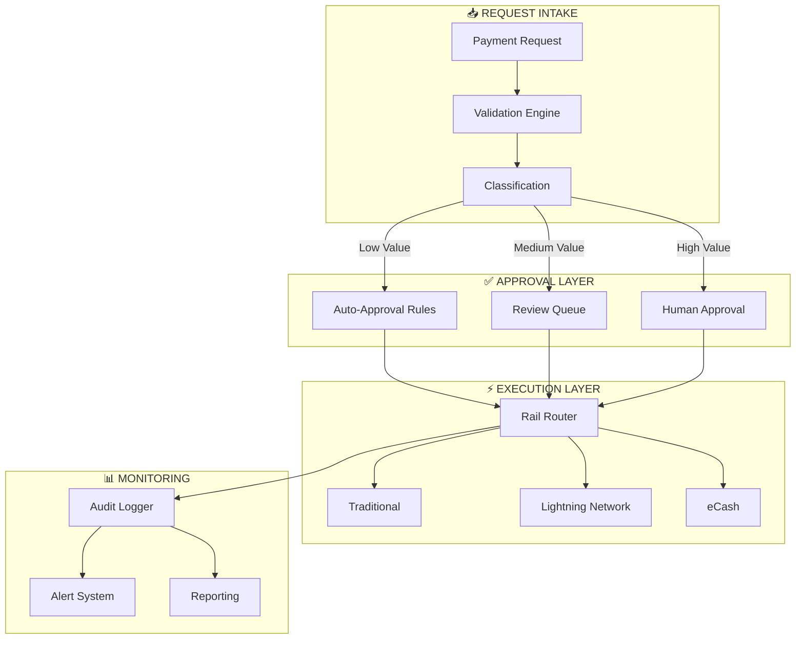

# Case Study: Autonomous Treasury Management

> Automated fund operations with multi-rail payment integration

## Problem Statement

A platform required automated financial operations across multiple payment rails (traditional, Lightning Network, eCash). Manual processing created bottlenecks, introduced errors, and limited operational hours.

**Requirements**:
- Automate routine payment approvals and executions
- Support multiple payment methods seamlessly
- Maintain complete audit trail for compliance
- Enable human override for exceptional cases
- Achieve high success rate with minimal intervention

## Solution Architecture

### Payment Flow Architecture



### Key Design Decisions

**1. Risk-Based Classification**
| Category | Criteria | Approval Type |
|----------|----------|---------------|
| Low Risk | Under threshold, known recipient | Auto-approve |
| Medium Risk | Above threshold, known recipient | Agent review |
| High Risk | Large amount OR unknown recipient | Human approval |

**2. Multi-Rail Routing**
- Traditional: For standard transfers
- Lightning Network: For instant, low-fee micropayments
- eCash: For privacy-preserving transactions

**3. Audit-First Design**
Every action logged before execution:
```json
{
  "action_id": "pay_2025_001234",
  "timestamp": "2025-01-15T10:30:00Z",
  "type": "payment_execution",
  "amount_range": "medium",
  "rail": "lightning",
  "approval": "auto",
  "status": "pending"
}
```

## Implementation Highlights

### Auto-Approval Rules Engine
```yaml
approval_rules:
  - name: "routine_low_value"
    conditions:
      - amount_tier: "low"
      - recipient_known: true
      - frequency: "recurring"
    action: "auto_approve"
    max_daily: 50

  - name: "new_recipient"
    conditions:
      - recipient_known: false
    action: "human_review"
    escalation_time: "4h"

  - name: "high_value"
    conditions:
      - amount_tier: "high"
    action: "human_approval"
    multi_sig_required: true
```

### Rail Selection Logic
```
1. Check recipient's supported rails
2. Evaluate amount vs. rail limits
3. Consider current fee environment
4. Apply privacy requirements
5. Select optimal rail
6. Execute with retry logic
```

### Security Patterns
- **Separation of concerns**: Request, approval, execution are isolated
- **Rate limiting**: Per-recipient and per-time-period limits
- **Multi-signature**: High-value transactions require multiple approvals
- **Anomaly detection**: Unusual patterns trigger holds

## Results

| Metric | Before | After | Improvement |
|--------|--------|-------|-------------|
| Processing Time | 4-24 hours | <5 minutes | 99% faster |
| Error Rate | 2.5% | 0.3% | 88% reduction |
| Manual Touchpoints | 8 per transaction | 0.2 average | 97% reduction |
| Operating Hours | Business hours | 24/7 | 3x coverage |
| Audit Completeness | 85% | 100% | Full coverage |

### Automation Level
- **Auto-approved**: 78% of transactions
- **Agent-reviewed**: 18% of transactions
- **Human-approved**: 4% of transactions

### Success Metrics
- **Transaction Success Rate**: 99.7%
- **First-Attempt Success**: 96.2%
- **Retry Success**: 99.1% (of failed first attempts)

## Lessons Learned

### What Worked Well
1. **Risk-based routing** minimized human workload appropriately
2. **Multi-rail support** optimized for cost and speed per transaction
3. **Comprehensive auditing** satisfied compliance requirements
4. **Graceful escalation** kept humans in loop for edge cases

### Challenges Overcome
1. **Lightning Network reliability**
   - Initial success rate: 89%
   - Solution: Added channel health monitoring and automatic rebalancing
   - Final success rate: 99.2%

2. **Timing sensitivity**
   - Some transactions time-sensitive but submitted after hours
   - Solution: Priority queue with time-based escalation
   - Result: Critical transactions processed within SLA

3. **False positive holds**
   - Early anomaly detection was too aggressive
   - Solution: Learning system adjusted thresholds based on feedback
   - Result: Hold rate reduced from 15% to 4%

### Would Do Differently
1. Build channel health monitoring earlier
2. Implement dry-run mode for new recipients
3. Add more granular amount tiers

## Technical Specifications

### Resource Requirements
- **Database**: Encrypted storage for audit logs
- **Compute**: Minimal (event-driven architecture)
- **Network**: Redundant connections to payment rails

### Integration Points
- **Notification**: Alerts for holds, completions, failures
- **Reporting**: Daily/weekly automated reports
- **Monitoring**: Real-time dashboards

## Applicability

### Good Fit
- Organizations with regular payment flows
- Multi-currency or multi-rail requirements
- Compliance-heavy environments
- Teams wanting to reduce manual processing

### Poor Fit
- One-time or irregular payments
- Single-rail simple operations
- No existing payment infrastructure
- Regulatory restrictions on automation

## Related Documentation

- [Payment Integration Patterns](../patterns/payment-integration.md)
- [Self-Healing Operations](self-healing-ops.md)
- [Security Infrastructure Guide](../patterns/security-patterns.md)

---

*Autonomous treasury transforms finance from bottleneck to enabler.*
