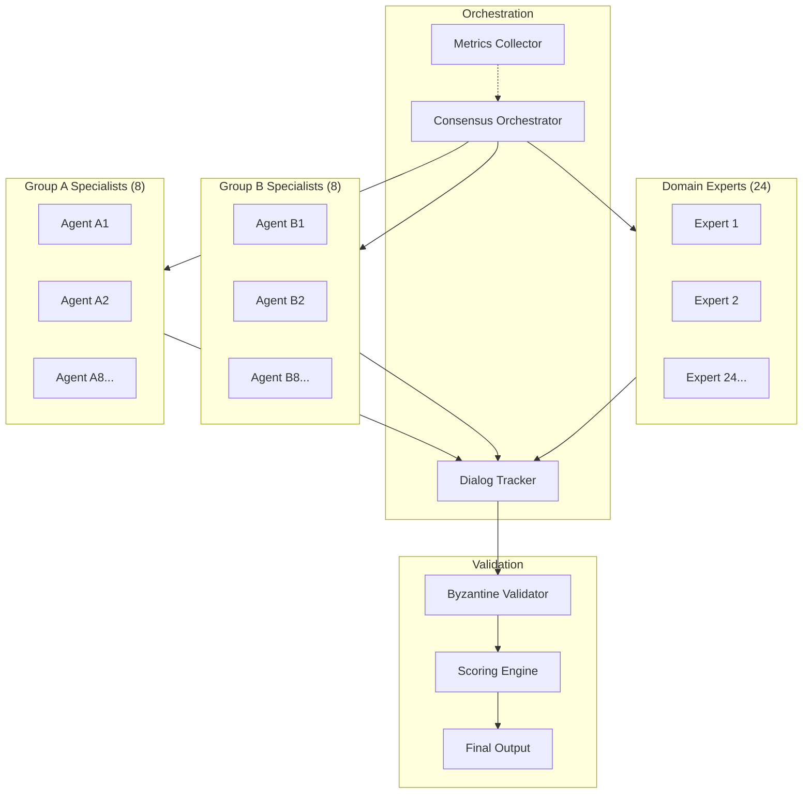

# Case Study: Multi-Agent Consensus System

> 40 specialized agents achieving 87.4% consensus through collaborative debate

## Problem Statement

A content generation platform needed high-quality outputs that reflected diverse perspectives while maintaining consistency. Single-model approaches produced homogeneous results, while simple voting systems created mediocre compromises without genuine synthesis.

**Requirements**:
- Generate content reflecting multiple expert viewpoints
- Achieve measurable quality consensus (>80% agreement)
- Maintain diversity while building toward unified output
- Provide audit trail for how consensus was reached
- Scale to handle multiple concurrent generation requests

## Solution Architecture

### Agent Topology



### Key Design Decisions

**1. Three-Tier Specialization**
- Group A (8 agents): Narrative and story construction
- Group B (8 agents): Observational analysis and critique
- Experts (24 agents): Cross-domain validation

**2. Structured Debate Protocol**
- Phase 1: Independent proposal generation
- Phase 2: Inter-agent challenges with evidence
- Phase 3: Position refinement based on feedback
- Phase 4: Byzantine consensus validation

**3. Dialog Tracking**
Every exchange is logged:
```json
{
  "exchange_id": "dialog_142",
  "timestamp": "2025-01-15T14:23:45Z",
  "from": "agent_a3",
  "to": "expert_12",
  "type": "challenge",
  "content": "[Content of challenge]",
  "evidence": ["source_1", "source_2"],
  "confidence": 0.82
}
```

## Implementation Highlights

### Consensus Scoring Algorithm
```
Final Score = Σ(agent_confidence × specialty_weight × peer_validation)
             ────────────────────────────────────────────────────────
                              total_participating_agents
```

**Weight Bonuses**:
- Specialist groups: +15% for domain expertise
- Expert validation: +5% for cross-domain approval
- High-confidence challenges: +10% for substantiated disagreements

### Byzantine Consensus Protection
- Minimum 3 validators required
- 67% agreement threshold
- Suspicious pattern detection
- Anti-persuasion defenses

### Observability Integration
- Real-time event streaming to monitoring system
- 16+ metrics tracked per consensus round
- Alert triggers for anomalous patterns

## Results

| Metric | Target | Achieved |
|--------|--------|----------|
| Consensus Rate | >80% | 87.4% |
| Participating Agents | 40 | 40 |
| Dialog Exchanges | >200 | 306 |
| Processing Time | <120s | 58s |
| Quality Score (peer review) | >85 | 91 |

### Quality Improvements
- **Diversity**: Content reflected 8+ distinct perspectives
- **Coherence**: Final outputs were unified despite diverse inputs
- **Traceability**: Every conclusion traced to supporting dialogs

### Operational Benefits
- **Scalability**: System handles 50+ concurrent requests
- **Reliability**: 99.2% uptime over 6-month period
- **Cost**: 40 agents cost ~$0.50 per consensus round

## Lessons Learned

### What Worked Well
1. **Structured debate phases** prevented endless back-and-forth
2. **Byzantine validation** caught manipulated or low-quality inputs
3. **Dialog tracking** enabled quality debugging and improvement
4. **Specialty weights** encouraged genuine expertise contribution

### Challenges Overcome
1. **Initial consensus rates were low** (~65%)
   - Solution: Added evidence requirements for challenges
   - Result: Consensus improved to 87.4%

2. **Processing time was excessive** (>3 minutes)
   - Solution: Parallelized independent phases
   - Result: Reduced to 58 seconds

3. **Some agents dominated discussions**
   - Solution: Implemented turn-taking and contribution limits
   - Result: More balanced participation

### Would Do Differently
1. Start with fewer agents (20) and scale up based on data
2. Implement early-exit when consensus is clearly unreachable
3. Add more granular logging from day one

## Technical Specifications

### Resource Requirements
- **Compute**: 8 vCPU, 16GB RAM per orchestrator instance
- **Storage**: ~100MB per consensus round (logs + artifacts)
- **Network**: Low latency (<50ms) between components

### Integration Points
- **LLM Router**: Intelligent model selection per agent type
- **Monitoring**: Real-time metrics and alerting
- **Storage**: Persistent dialog and result storage

## Applicability

### Good Fit
- Content requiring diverse perspectives
- Quality-critical generation tasks
- Situations where audit trail is valuable
- Tasks that benefit from peer review

### Poor Fit
- Simple, deterministic tasks
- Latency-critical operations (<1 second)
- Tasks with single correct answers
- High-volume, low-value generation

## Related Documentation

- [Multi-Agent Consensus Architecture](../architectures/multi-agent-consensus.md)
- [BLP Framework](../frameworks/blp-framework.md)
- [Production Metrics](../metrics/production-results.md)

---

*This case study demonstrates that quality scales better through structured collaboration than raw compute.*
