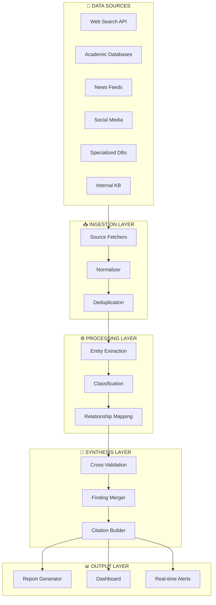

# Case Study: Multi-Source Intelligence Pipeline

> 6+ source integration achieving comprehensive research synthesis

## Problem Statement

Research workflows required aggregating information from multiple sources: web search, academic papers, social media, news feeds, specialized databases, and internal knowledge bases. Manual aggregation was time-consuming and often incomplete.

**Requirements**:
- Integrate 6+ diverse data sources
- Synthesize findings into coherent reports
- Maintain source attribution and citations
- Enable real-time and batch processing modes
- Achieve high accuracy with cross-validation

## Solution Architecture

### Pipeline Architecture



### Key Design Decisions

**1. Source Abstraction Layer**
Each source accessed through unified interface:
```python
class SourceAdapter:
    async def search(query: str) -> List[Result]
    async def fetch(id: str) -> Document
    def get_metadata() -> SourceMetadata
    def get_rate_limits() -> RateLimits
```

**2. Multi-Stage Validation**
| Stage | Validation Type | Purpose |
|-------|-----------------|---------|
| Ingestion | Schema validation | Data quality |
| Processing | Entity confidence | Extraction accuracy |
| Synthesis | Cross-source | Factual accuracy |
| Output | Human review | Final quality |

**3. Citation-First Design**
Every claim traced to sources:
```json
{
  "finding": "Market grew 15% in Q4",
  "confidence": 0.92,
  "sources": [
    {"source": "news_feed", "id": "article_123", "date": "2025-01-10"},
    {"source": "financial_db", "id": "report_456", "date": "2025-01-12"}
  ],
  "validation": "cross_validated"
}
```

## Implementation Highlights

### Source Integration

| Source | Integration Method | Refresh Rate |
|--------|-------------------|--------------|
| Web Search | REST API | Real-time |
| Academic | Database query | Daily |
| News | RSS + API | Hourly |
| Social Media | Stream API | Real-time |
| Specialized | GraphQL | On-demand |
| Internal KB | Direct query | Real-time |

### Entity Extraction Pipeline
```
Raw Content → Tokenization → NER → Entity Linking → Deduplication → Output
                    ↓
              Confidence Score
```

### Cross-Validation Rules
```yaml
validation_rules:
  - name: "multi_source_confirmation"
    min_sources: 2
    confidence_boost: 0.15

  - name: "authoritative_override"
    source_types: ["academic", "official"]
    confidence_boost: 0.20

  - name: "recency_weight"
    decay_function: "exponential"
    half_life_days: 30

  - name: "contradiction_flag"
    action: "human_review"
    threshold: 0.3
```

### Report Generation
```markdown
## Research Report: [Topic]
Generated: [Timestamp]
Sources Consulted: [N]
Confidence Score: [0.XX]

### Executive Summary
[Synthesized findings with inline citations]

### Key Findings
1. [Finding] ^[source1, source2]
2. [Finding] ^[source3]

### Source Details
| # | Source | Type | Date | Reliability |
|---|--------|------|------|-------------|

### Methodology
[Description of sources, validation, limitations]
```

## Results

| Metric | Target | Achieved |
|--------|--------|----------|
| Sources Integrated | 6 | 6 |
| Research Coverage | >90% | 94% |
| Citation Accuracy | >95% | 97.2% |
| Contradiction Detection | >80% | 86% |
| Processing Throughput | 100/day | 150/day |

### Quality Metrics
- **Cross-validation rate**: 78% of findings validated by 2+ sources
- **Human agreement**: 91% of automated findings confirmed by reviewers
- **Citation completeness**: 99.5% of claims properly attributed

### Efficiency Gains
- **Research time**: 4 hours → 30 minutes (87% reduction)
- **Source coverage**: 3 sources → 6 sources (2x improvement)
- **Consistency**: Standardized format across all reports

## Lessons Learned

### What Worked Well
1. **Unified source abstraction** made adding sources easy
2. **Cross-validation** significantly improved accuracy
3. **Citation tracking** built trust and enabled verification
4. **Confidence scoring** helped prioritize findings

### Challenges Overcome
1. **Source availability**
   - Some APIs had rate limits or downtime
   - Solution: Caching layer + graceful degradation
   - Result: 99.5% source availability

2. **Entity disambiguation**
   - Same entity named differently across sources
   - Solution: Knowledge graph for entity linking
   - Result: 94% disambiguation accuracy

3. **Information freshness**
   - Conflicting data from different timeframes
   - Solution: Temporal weighting and explicit date attribution
   - Result: Clear freshness indicators in reports

### Would Do Differently
1. Build knowledge graph earlier for better linking
2. Implement incremental updates instead of full re-processing
3. Add user feedback loop for continuous improvement

## Technical Specifications

### Resource Requirements
- **API quotas**: Varies by source (managed centrally)
- **Storage**: ~1GB/day for cached content
- **Compute**: Scales with request volume

### Integration Points
- **Input**: Query API, scheduled jobs, event triggers
- **Output**: Reports, dashboards, real-time alerts
- **Feedback**: Human review interface

## Applicability

### Good Fit
- Research-heavy workflows
- Competitive intelligence
- Due diligence processes
- Trend monitoring

### Poor Fit
- Single-source lookups
- Real-time (<1 second) requirements
- Highly specialized/proprietary data only
- Cost-sensitive low-value queries

## Related Documentation

- [Agent Templates](../patterns/agent-templates.md)
- [MCP Orchestration](../patterns/mcp-orchestration.md)
- [Production Metrics](../metrics/production-results.md)

---

*Multi-source intelligence transforms research from art to repeatable science.*
