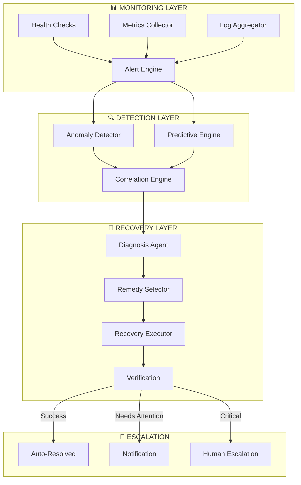

# Case Study: Self-Healing Operations System

> 98% job success rate through autonomous monitoring and recovery

## Problem Statement

A multi-agent platform running 130+ agents experienced unpredictable failures requiring manual intervention. On-call engineers faced alert fatigue, and recovery times varied significantly based on who responded and when.

**Requirements**:
- Reduce manual interventions by 90%+
- Achieve 98%+ job success rate
- Provide complete observability across all agents
- Enable proactive issue detection before impact
- Maintain human oversight for critical decisions

## Solution Architecture

### Self-Healing Architecture



### Key Design Decisions

**1. Multi-Signal Health Assessment**
Instead of single metrics, health is computed from multiple signals:
```
Health Score = w1×Availability + w2×Latency + w3×ErrorRate + w4×Throughput
```

**2. Pattern-Based Recovery**
Recovery actions are chosen based on historical patterns:
| Pattern | Diagnosis | Recovery Action |
|---------|-----------|-----------------|
| Memory spike | Memory leak | Restart service |
| Connection errors | Network issue | Retry with backoff |
| Timeout increase | Overload | Scale up resources |
| Cascading failures | Dependency failure | Circuit break |

**3. Verification Before Close**
No issue is considered resolved until verified:
- Health metrics return to baseline
- No new related alerts for 5 minutes
- Downstream services unaffected

## Implementation Highlights

### Health Check Framework
```python
health_check_config = {
    "agent_name": "research-coordinator",
    "checks": [
        {"type": "http", "endpoint": "/health", "interval": "30s"},
        {"type": "metric", "name": "error_rate", "threshold": 0.05},
        {"type": "metric", "name": "latency_p99", "threshold": 5000},
        {"type": "log", "pattern": "FATAL|CRITICAL", "window": "5m"}
    ],
    "recovery_actions": [
        "restart_service",
        "scale_resources",
        "circuit_break",
        "rollback_version"
    ]
}
```

### Anomaly Detection
- **Statistical**: Z-score for metric deviations
- **Pattern**: Known failure signatures
- **Predictive**: ML model for forecasting issues

### Recovery Playbooks
```yaml
playbook: service_restart
trigger:
  - condition: memory_usage > 90%
  - condition: error_rate > 5%
steps:
  - action: capture_diagnostics
  - action: graceful_shutdown
    timeout: 30s
  - action: start_service
  - action: verify_health
    wait: 60s
rollback:
  - action: restore_previous_version
```

### Circuit Breaker Pattern
```
States:
- CLOSED: Normal operation
- OPEN: Blocking calls, returning cached/default
- HALF-OPEN: Testing if service recovered

Transitions:
- CLOSED → OPEN: Error threshold exceeded
- OPEN → HALF-OPEN: Timeout elapsed
- HALF-OPEN → CLOSED: Health check passed
- HALF-OPEN → OPEN: Health check failed
```

## Results

| Metric | Before | After | Improvement |
|--------|--------|-------|-------------|
| Job Success Rate | 78% | 98% | +26% |
| Manual Interventions | 15/day | 1/week | -97% |
| Mean Time to Recovery | 45 min | 3 min | -93% |
| Alert Fatigue (pages/day) | 25 | 2 | -92% |
| False Positive Rate | 35% | 8% | -77% |

### Recovery Distribution
- **Auto-healed**: 89% of incidents
- **Auto-healed with notification**: 8% of incidents
- **Human escalation**: 3% of incidents

### Availability Achievement
- **Planned downtime**: 0.5%
- **Unplanned downtime**: 0.4%
- **Total availability**: 99.1%

## Lessons Learned

### What Worked Well
1. **Multi-signal health** reduced false positives significantly
2. **Pattern-based recovery** enabled rapid, consistent response
3. **Verification loop** prevented premature resolution
4. **Graduated escalation** kept humans informed without overloading

### Challenges Overcome
1. **Alert storm during incidents**
   - Multiple alerts for single root cause
   - Solution: Correlation engine groups related alerts
   - Result: 70% reduction in alert volume

2. **Recovery actions causing new issues**
   - Restarts during traffic spikes caused cascades
   - Solution: Added pre-checks and traffic draining
   - Result: Zero recovery-induced incidents

3. **Predictive model accuracy**
   - Initial model had high false positive rate
   - Solution: Feedback loop for model retraining
   - Result: Prediction accuracy improved from 62% to 84%

### Would Do Differently
1. Implement correlation engine earlier
2. Build feedback mechanism for recovery effectiveness
3. Add more granular recovery actions

## Technical Specifications

### Resource Requirements
- **Monitoring agents**: 1 per 20 production agents
- **Storage**: ~500MB/day for metrics and logs
- **Compute**: Event-driven, minimal steady-state

### Integration Points
- **Alerting**: WhatsApp, Email, Dashboard
- **Logging**: Centralized log aggregation
- **Metrics**: Time-series database

## Applicability

### Good Fit
- Systems with 10+ services/agents
- Teams experiencing alert fatigue
- Organizations wanting to reduce MTTR
- 24/7 operations without 24/7 staffing

### Poor Fit
- Simple, single-service deployments
- Systems with highly variable "normal" state
- Environments requiring human approval for all changes
- Early-stage prototypes

## Related Documentation

- [DITD Operations Phase](../architectures/ditd-framework.md#5-operations-phase)
- [BLP Durability Properties](../frameworks/blp-framework.md#category-3-durability)
- [Production Metrics](../metrics/production-results.md)

---

*Self-healing transforms operations from reactive firefighting to proactive stability.*
