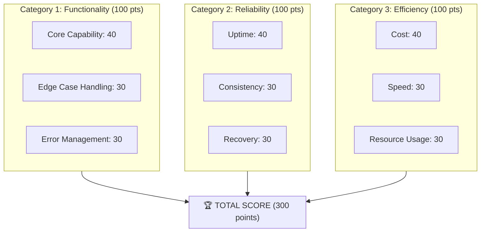

# CAA 300-Point Scoring System

> Comprehensive Agent Assessment with 30-node granular metrics

## Overview

The Comprehensive Agent Assessment (CAA) scoring system provides a standardized methodology for evaluating AI agent quality, performance, and production readiness. The 300-point scale enables fine-grained differentiation between implementations while maintaining actionable thresholds.

## Scoring Architecture



## Detailed Node Structure

### Category 1: Functionality (100 points)

#### 1.1 Core Capability (40 points)
| Node | Points | Criteria |
|------|--------|----------|
| 1.1.1 Task Completion | 15 | Successfully completes primary tasks |
| 1.1.2 Output Quality | 10 | Meets quality thresholds |
| 1.1.3 Instruction Following | 10 | Adheres to specifications |
| 1.1.4 Context Utilization | 5 | Uses available context effectively |

#### 1.2 Edge Case Handling (30 points)
| Node | Points | Criteria |
|------|--------|----------|
| 1.2.1 Input Validation | 10 | Handles malformed inputs |
| 1.2.2 Boundary Conditions | 10 | Manages limits correctly |
| 1.2.3 Unexpected Scenarios | 10 | Graceful degradation |

#### 1.3 Error Management (30 points)
| Node | Points | Criteria |
|------|--------|----------|
| 1.3.1 Error Detection | 10 | Identifies failures |
| 1.3.2 Error Reporting | 10 | Clear error messages |
| 1.3.3 Error Recovery | 10 | Returns to operational state |

### Category 2: Reliability (100 points)

#### 2.1 Uptime (40 points)
| Node | Points | Criteria |
|------|--------|----------|
| 2.1.1 Availability | 15 | System accessible when needed |
| 2.1.2 Stability | 15 | No unexpected crashes |
| 2.1.3 Maintenance Windows | 10 | Planned downtime only |

#### 2.2 Consistency (30 points)
| Node | Points | Criteria |
|------|--------|----------|
| 2.2.1 Determinism | 10 | Same input → same output |
| 2.2.2 State Management | 10 | Correct state handling |
| 2.2.3 Version Stability | 10 | Consistent across versions |

#### 2.3 Recovery (30 points)
| Node | Points | Criteria |
|------|--------|----------|
| 2.3.1 Auto-Recovery | 10 | Self-healing capability |
| 2.3.2 Data Integrity | 10 | No data loss on failure |
| 2.3.3 Rollback | 10 | Can revert to previous state |

### Category 3: Efficiency (100 points)

#### 3.1 Cost (40 points)
| Node | Points | Criteria |
|------|--------|----------|
| 3.1.1 Token Efficiency | 15 | Minimal token usage |
| 3.1.2 API Cost | 15 | Optimized provider usage |
| 3.1.3 Compute Cost | 10 | Efficient resource usage |

#### 3.2 Speed (30 points)
| Node | Points | Criteria |
|------|--------|----------|
| 3.2.1 Latency | 15 | Quick response times |
| 3.2.2 Throughput | 10 | High request handling |
| 3.2.3 Parallelization | 5 | Concurrent processing |

#### 3.3 Resource Usage (30 points)
| Node | Points | Criteria |
|------|--------|----------|
| 3.3.1 Memory | 10 | Efficient memory usage |
| 3.3.2 CPU | 10 | Appropriate CPU utilization |
| 3.3.3 Storage | 10 | Minimal storage footprint |

## Scoring Thresholds

| Score Range | Grade | Production Readiness |
|-------------|-------|----------------------|
| 270-300 | A+ | Production Excellent |
| 240-269 | A | Production Ready |
| 210-239 | B | Production with Monitoring |
| 180-209 | C | Staging Only |
| 150-179 | D | Development Only |
| < 150 | F | Requires Significant Work |

## Calculation Methodology

### Per-Node Scoring
```
Node Score = Base Points × Achievement Percentage

Example:
- Task Completion (15 points max)
- Agent completes 95% of tasks successfully
- Score = 15 × 0.95 = 14.25 points
```

### Category Aggregation
```
Category Score = Σ(Node Scores in Category)
```

### Total Score
```
Total CAA Score = Functionality + Reliability + Efficiency
```

### Weighted Alternative (For Specialized Agents)
```
Weighted Score = (F × wF) + (R × wR) + (E × wE)

Where wF + wR + wE = 1.0
```

**Common Weight Profiles**:
| Profile | Functionality | Reliability | Efficiency |
|---------|---------------|-------------|------------|
| General Purpose | 0.33 | 0.33 | 0.33 |
| Critical Systems | 0.20 | 0.50 | 0.30 |
| High-Volume | 0.30 | 0.20 | 0.50 |
| Research | 0.50 | 0.20 | 0.30 |

## Assessment Process

### Step 1: Data Collection
```
1. Run agent through standard test suite
2. Collect metrics from monitoring systems
3. Review logs for error patterns
4. Measure resource consumption
```

### Step 2: Node Scoring
```
For each of 30 nodes:
1. Determine relevant metrics
2. Calculate achievement percentage
3. Apply to base points
4. Document rationale
```

### Step 3: Validation
```
1. Cross-check scores with actual performance
2. Identify scoring anomalies
3. Adjust for edge cases
4. Document exceptions
```

### Step 4: Reporting
```
1. Generate score card
2. Highlight areas for improvement
3. Compare to previous assessments
4. Set improvement targets
```

## Example Scorecard

```
Agent: research-coordinator-v2.1
Assessment Date: 2025-01-15
Assessor: Automated CAA System

FUNCTIONALITY (100 pts)
├── Core Capability: 38/40
│   ├── Task Completion: 14/15
│   ├── Output Quality: 9/10
│   ├── Instruction Following: 10/10
│   └── Context Utilization: 5/5
├── Edge Case Handling: 27/30
│   ├── Input Validation: 9/10
│   ├── Boundary Conditions: 8/10
│   └── Unexpected Scenarios: 10/10
└── Error Management: 28/30
    ├── Error Detection: 10/10
    ├── Error Reporting: 9/10
    └── Error Recovery: 9/10
Subtotal: 93/100

RELIABILITY (100 pts)
├── Uptime: 39/40
├── Consistency: 28/30
└── Recovery: 29/30
Subtotal: 96/100

EFFICIENCY (100 pts)
├── Cost: 37/40
├── Speed: 28/30
└── Resource Usage: 27/30
Subtotal: 92/100

═══════════════════════════════
TOTAL CAA SCORE: 281/300 (A+)
═══════════════════════════════

PRODUCTION READINESS: EXCELLENT
```

## Improvement Tracking

### Score History
```
Version  Date        Score   Grade   Notes
-------  ----------  -----   -----   -----
v1.0     2024-06-01  198     C       Initial release
v1.5     2024-09-01  234     B       Error handling improved
v2.0     2024-12-01  267     A       Reliability overhaul
v2.1     2025-01-15  281     A+      Efficiency optimization
```

### Target Setting
```
Current: 281 (A+)
Target: 290 (A+)

Focus Areas:
- Edge Case Handling: +3 points possible
- Speed: +2 points possible
- Resource Usage: +3 points possible
```

## Integration Points

### With BLP Framework
Each BLP category maps to CAA nodes:
- Alignment → Functionality
- Durability → Reliability
- Autonomy/Self-Improvement → Efficiency

### With DITD Lifecycle
CAA assessments at each phase:
- Post-Design: Target score defined
- Post-Implement: Initial assessment
- Post-Test: Pre-production check
- Post-Deploy: Production validation
- Operations: Continuous monitoring

## Related Frameworks

- [BLP Framework](blp-framework.md)
- [Requirement Traceability](requirement-traceability.md)
- [DITD Framework](../architectures/ditd-framework.md)

---

*CAA scoring transforms subjective quality into objective measurement.*
