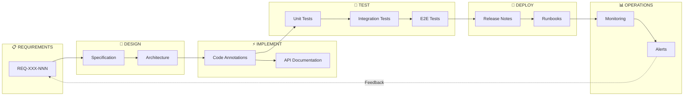

# Requirement Traceability Methodology

> REQ-XXX-NNN format for complete implementation accountability

## Overview

Requirement Traceability ensures every feature, test, and deployment decision maps back to explicit requirements. The REQ-XXX-NNN format provides standardized identifiers that flow from design through operations, creating an auditable chain of accountability.

## Identifier Format

```
REQ-{CATEGORY}-{NUMBER}

Where:
- CATEGORY: 3-letter domain code
- NUMBER: 3-digit sequential identifier
```

### Category Codes

| Code | Domain | Description |
|------|--------|-------------|
| FUN | Functional | Core capabilities |
| REL | Reliability | Uptime, stability |
| PER | Performance | Speed, efficiency |
| SEC | Security | Protection, privacy |
| INT | Integration | External systems |
| UXP | User Experience | Interaction quality |
| OPS | Operations | Deployment, monitoring |
| DOC | Documentation | Guides, references |
| TST | Testing | Quality assurance |
| MNT | Maintenance | Updates, fixes |

### Number Ranges

| Range | Meaning |
|-------|---------|
| 001-099 | Critical requirements |
| 100-199 | High priority |
| 200-299 | Medium priority |
| 300-399 | Low priority |
| 400-499 | Nice-to-have |
| 500-599 | Future consideration |

## Example Requirements

```markdown
REQ-FUN-001: System shall process voice transcripts into actionable items
REQ-FUN-002: System shall support multiple LLM providers with fallback
REQ-FUN-003: System shall maintain state across restarts

REQ-REL-001: System shall achieve 99% uptime
REQ-REL-002: System shall recover from failures within 5 minutes

REQ-PER-001: System shall process requests in under 30 seconds
REQ-PER-002: System shall support 100 concurrent operations

REQ-SEC-001: System shall encrypt all sensitive data at rest
REQ-SEC-002: System shall validate all external inputs

REQ-INT-001: System shall integrate with Notion API
REQ-INT-002: System shall support webhook notifications
```

## Traceability Matrix

```
┌─────────────────┬────────────────────────────────────────────────────────┐
│  Requirement    │  Implementation    │  Test Cases    │  Deployment     │
├─────────────────┼────────────────────┼────────────────┼─────────────────┤
│  REQ-FUN-001    │  processor.py:45   │  test_proc_01  │  v1.0.0        │
│  REQ-FUN-002    │  router.py:120     │  test_fall_01  │  v1.1.0        │
│  REQ-REL-001    │  monitor.py:30     │  test_up_01    │  v1.0.0        │
│  REQ-SEC-001    │  crypto.py:15      │  test_enc_01   │  v1.2.0        │
└─────────────────┴────────────────────┴────────────────┴─────────────────┘
```

## Annotation Standards

### In Code
```python
# REQ-FUN-001: Process voice transcripts into actionable items
def process_transcript(transcript: str) -> List[ActionItem]:
    """
    Implements: REQ-FUN-001
    Related: REQ-PER-001 (30-second timeout)
    """
    pass
```

### In Tests
```python
class TestTranscriptProcessing:
    """
    Tests for: REQ-FUN-001, REQ-FUN-002
    Coverage: Critical path + error handling
    """

    def test_basic_processing(self):
        """
        Validates: REQ-FUN-001
        Scenario: Standard transcript with action items
        """
        pass
```

### In Documentation
```markdown
## Feature: Transcript Processing

**Requirement**: REQ-FUN-001

### Description
The system processes voice transcripts from the Limitless API...

### Acceptance Criteria
- [ ] Transcripts are parsed correctly
- [ ] Action items are extracted
- [ ] State is persisted

### Related Requirements
- REQ-PER-001: Performance constraint
- REQ-REL-002: Recovery requirement
```

## Lifecycle Flow



## Coverage Reports

### Format
```markdown
# Requirement Coverage Report
Generated: 2025-01-15

## Summary
- Total Requirements: 45
- Implemented: 43 (96%)
- Tested: 41 (91%)
- Deployed: 40 (89%)

## By Category
| Category | Total | Implemented | Tested | Deployed |
|----------|-------|-------------|--------|----------|
| FUN | 15 | 15 (100%) | 15 (100%) | 15 (100%) |
| REL | 8 | 8 (100%) | 7 (88%) | 7 (88%) |
| PER | 6 | 5 (83%) | 5 (83%) | 5 (83%) |
| SEC | 10 | 10 (100%) | 10 (100%) | 10 (100%) |
| INT | 6 | 5 (83%) | 4 (67%) | 3 (50%) |

## Gaps
| Requirement | Status | Blocker |
|-------------|--------|---------|
| REQ-PER-002 | In Progress | Performance optimization |
| REQ-INT-005 | Blocked | External API unavailable |
| REQ-INT-006 | Not Started | Dependency on INT-005 |
```

## Change Management

### Requirement Changes
```markdown
## Change Request: CR-2025-001

**Affected Requirement**: REQ-FUN-001
**Type**: Enhancement
**Priority**: High

### Current State
System processes transcripts with basic extraction

### Proposed Change
Add problem analysis detection to transcript processing

### Impact Analysis
- Code: processor.py, extractor.py (+200 LOC)
- Tests: +15 test cases
- Documentation: API docs, user guide updates
- Deployment: Database migration required

### Traceability Updates
- New requirement: REQ-FUN-015 (Problem Analysis)
- Modified: REQ-FUN-001 (adds PA trigger)
- New tests: test_pa_001 through test_pa_015
```

## Automation Support

### CI/CD Integration
```yaml
# .github/workflows/traceability.yml
name: Requirement Traceability Check

on: [pull_request]

jobs:
  trace-check:
    runs-on: ubuntu-latest
    steps:
      - uses: actions/checkout@v3

      - name: Scan for requirement annotations
        run: |
          # Find all REQ-XXX-NNN patterns
          grep -rn "REQ-[A-Z]{3}-[0-9]{3}" src/ tests/ docs/

      - name: Validate coverage
        run: |
          python scripts/trace_validator.py \
            --requirements requirements.md \
            --source src/ \
            --tests tests/ \
            --threshold 90
```

### Automated Reports
```python
def generate_trace_report():
    """
    Scans codebase for requirement annotations
    Generates coverage matrix
    Identifies gaps
    """
    requirements = parse_requirements("requirements.md")
    implementations = scan_codebase("src/")
    tests = scan_tests("tests/")

    matrix = build_trace_matrix(requirements, implementations, tests)
    gaps = identify_gaps(matrix)

    return TraceReport(matrix, gaps)
```

## Best Practices

### Do's
- Assign requirements before implementation
- Update annotations when code changes
- Include requirements in commit messages
- Review traceability in code reviews
- Generate reports regularly

### Don'ts
- Don't create orphan implementations (code without requirements)
- Don't leave test cases unlinked
- Don't skip traceability for "minor" changes
- Don't rely solely on manual tracking

## Integration with Frameworks

### BLP Mapping
Each BLP property should have corresponding requirements:
```
BLP-001 (Goal Clarity) → REQ-FUN-001, REQ-FUN-002
BLP-021 (State Persistence) → REQ-REL-003
BLP-031 (Performance Tracking) → REQ-PER-001
```

### CAA Scoring
Requirement coverage impacts CAA scores:
- 100% coverage: Full points for related nodes
- <90% coverage: Proportional penalty
- Untested requirements: Flag for review

## Related Frameworks

- [BLP Framework](blp-framework.md)
- [CAA Scoring System](caa-scoring.md)
- [DITD Framework](../architectures/ditd-framework.md)

---

*Requirement traceability transforms "it works" into "it provably meets specifications."*
