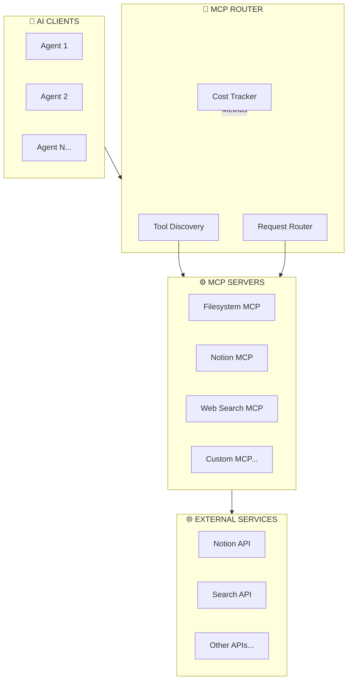

# MCP Orchestration Patterns

> Tool discovery, workflow integration, and cost-tracked execution

## Overview

Model Context Protocol (MCP) provides standardized tool access for AI agents. These patterns ensure efficient, observable, and cost-effective tool orchestration.

## MCP Architecture



## Tool Discovery Pattern

### Manifest-Based Discovery
```json
{
  "server_name": "notion-mcp",
  "version": "1.0.0",
  "tools": [
    {
      "name": "notion_search",
      "description": "Search Notion workspace",
      "parameters": {
        "query": {"type": "string", "required": true},
        "database_id": {"type": "string", "required": false}
      },
      "cost_per_call": 0.001,
      "rate_limit": 60
    },
    {
      "name": "notion_create_page",
      "description": "Create a new Notion page",
      "parameters": {
        "title": {"type": "string", "required": true},
        "content": {"type": "string", "required": true},
        "database_id": {"type": "string", "required": true}
      },
      "cost_per_call": 0.002,
      "rate_limit": 30
    }
  ]
}
```

### Dynamic Discovery
```python
class MCPDiscovery:
    """Discover available MCP tools at runtime."""

    async def discover_tools(self) -> Dict[str, ToolDefinition]:
        """Discover all available tools from configured servers."""
        tools = {}
        for server in self.servers:
            manifest = await server.get_manifest()
            for tool in manifest["tools"]:
                tool_id = f"{server.name}__{tool['name']}"
                tools[tool_id] = ToolDefinition(
                    server=server.name,
                    name=tool["name"],
                    description=tool["description"],
                    parameters=tool["parameters"],
                    cost=tool.get("cost_per_call", 0),
                    rate_limit=tool.get("rate_limit", 60)
                )
        return tools

    def find_tool(self, capability: str) -> Optional[ToolDefinition]:
        """Find tool by capability description."""
        # Use semantic search or keyword matching
        pass
```

## Cost-Tracked Wrapper Pattern

```python
class CostTrackedMCPWrapper:
    """
    Wrapper that tracks costs for all MCP tool calls.

    Features:
        - Per-call cost tracking
        - Daily/monthly budgets
        - Alert on budget thresholds
        - Usage analytics
    """

    def __init__(self, mcp_client, budget_config: BudgetConfig):
        self.client = mcp_client
        self.budget = budget_config
        self.usage = UsageTracker()

    async def call_tool(
        self,
        tool_name: str,
        parameters: Dict,
        metadata: Optional[Dict] = None
    ) -> ToolResult:
        """Execute tool with cost tracking."""

        # Pre-call budget check
        estimated_cost = self._estimate_cost(tool_name)
        if not self.budget.can_afford(estimated_cost):
            raise BudgetExceededError(f"Budget exceeded for {tool_name}")

        # Execute call with timing
        start_time = time.time()
        try:
            result = await self.client.call(tool_name, parameters)
            success = True
            error = None
        except Exception as e:
            result = None
            success = False
            error = str(e)
            raise

        finally:
            # Record usage
            duration_ms = (time.time() - start_time) * 1000
            actual_cost = self._calculate_actual_cost(tool_name, result)

            self.usage.record(UsageRecord(
                tool_name=tool_name,
                timestamp=time.time(),
                duration_ms=duration_ms,
                cost=actual_cost,
                success=success,
                error=error,
                metadata=metadata
            ))

            # Check budget alerts
            self._check_budget_alerts()

        return result

    def get_usage_report(self, period: str = "day") -> UsageReport:
        """Get usage report for specified period."""
        return self.usage.aggregate(period)
```

## Workflow Integration Pattern

### Sequential Workflow
```yaml
workflow: research_pipeline
steps:
  - name: search_web
    tool: web_search__search
    input:
      query: "${input.topic}"
    output: web_results

  - name: search_notion
    tool: notion__search
    input:
      query: "${input.topic}"
    output: notion_results

  - name: synthesize
    tool: llm__complete
    input:
      prompt: |
        Synthesize findings from:
        Web: ${web_results}
        Internal: ${notion_results}
    output: synthesis
```

### Parallel Workflow
```yaml
workflow: multi_source_research
parallel_steps:
  - name: source_a
    tool: source_a__search
    input: { query: "${input.query}" }

  - name: source_b
    tool: source_b__search
    input: { query: "${input.query}" }

  - name: source_c
    tool: source_c__search
    input: { query: "${input.query}" }

join:
  name: merge_results
  tool: llm__synthesize
  input:
    sources:
      - ${source_a.result}
      - ${source_b.result}
      - ${source_c.result}
```

### Conditional Workflow
```yaml
workflow: smart_research
steps:
  - name: initial_search
    tool: web_search__quick
    input: { query: "${input.query}" }
    output: initial

  - name: check_quality
    condition: "${initial.confidence} < 0.8"
    steps:
      - name: deep_search
        tool: academic__search
        input: { query: "${input.query}" }

  - name: synthesize
    tool: llm__complete
    input:
      results: "${all_results}"
```

## Error Handling Pattern

```python
class ResilientMCPClient:
    """MCP client with comprehensive error handling."""

    async def call_with_retry(
        self,
        tool_name: str,
        parameters: Dict,
        max_retries: int = 3,
        backoff_base: float = 1.0
    ) -> ToolResult:
        """Call tool with exponential backoff retry."""

        last_error = None
        for attempt in range(max_retries):
            try:
                return await self.call_tool(tool_name, parameters)

            except RateLimitError as e:
                # Wait for rate limit reset
                wait_time = e.retry_after or (backoff_base * (2 ** attempt))
                self.logger.warning(f"Rate limited, waiting {wait_time}s")
                await asyncio.sleep(wait_time)
                last_error = e

            except TransientError as e:
                # Retry with backoff
                wait_time = backoff_base * (2 ** attempt)
                self.logger.warning(f"Transient error, retrying in {wait_time}s")
                await asyncio.sleep(wait_time)
                last_error = e

            except PermanentError as e:
                # Don't retry permanent errors
                self.logger.error(f"Permanent error: {e}")
                raise

        raise MaxRetriesExceededError(f"Failed after {max_retries} attempts", last_error)

    async def call_with_fallback(
        self,
        primary_tool: str,
        fallback_tools: List[str],
        parameters: Dict
    ) -> ToolResult:
        """Try primary tool, fall back to alternatives on failure."""

        tools = [primary_tool] + fallback_tools
        errors = []

        for tool in tools:
            try:
                result = await self.call_with_retry(tool, parameters)
                if tool != primary_tool:
                    self.logger.info(f"Succeeded with fallback: {tool}")
                return result
            except Exception as e:
                errors.append((tool, e))
                continue

        raise AllToolsFailedError(errors)
```

## Observability Pattern

```python
class ObservableMCPClient:
    """MCP client with comprehensive observability."""

    def __init__(self, client, metrics_backend):
        self.client = client
        self.metrics = metrics_backend

    async def call_tool(self, tool_name: str, parameters: Dict) -> ToolResult:
        """Execute tool with full observability."""

        # Create span for tracing
        with self.metrics.span(f"mcp.{tool_name}") as span:
            span.set_attribute("tool.name", tool_name)
            span.set_attribute("tool.parameters", json.dumps(parameters))

            start_time = time.time()
            try:
                result = await self.client.call(tool_name, parameters)

                # Record success metrics
                duration = time.time() - start_time
                self.metrics.histogram("mcp.call.duration", duration, tags={"tool": tool_name})
                self.metrics.increment("mcp.call.success", tags={"tool": tool_name})

                span.set_attribute("tool.success", True)
                span.set_attribute("tool.duration_ms", duration * 1000)

                return result

            except Exception as e:
                # Record failure metrics
                self.metrics.increment("mcp.call.failure", tags={"tool": tool_name, "error": type(e).__name__})
                span.set_attribute("tool.success", False)
                span.set_attribute("tool.error", str(e))
                raise
```

## Server Configuration Pattern

```yaml
# mcp_servers.yaml
servers:
  - name: notion
    command: ["npx", "@notionhq/notion-mcp"]
    env:
      NOTION_API_KEY: "${NOTION_API_KEY}"
    health_check:
      endpoint: /health
      interval: 30s

  - name: filesystem
    command: ["python", "-m", "mcp_filesystem"]
    args:
      - "--root=/workspace"
      - "--read-only=false"
    rate_limit: 100

  - name: web_search
    command: ["python", "-m", "mcp_web_search"]
    env:
      SEARCH_API_KEY: "${SEARCH_API_KEY}"
    budget:
      daily_limit: 10.00
      alert_threshold: 0.80
```

## Best Practices

### Do's
- Implement cost tracking for all tools
- Use rate limiting to prevent API abuse
- Add fallback chains for critical tools
- Log all tool calls for debugging
- Validate parameters before calling

### Don'ts
- Don't ignore rate limit errors
- Don't hardcode API keys
- Don't skip error handling
- Don't allow unlimited budgets
- Don't call tools without tracing

## Related Documentation

- [Agent Templates](agent-templates.md)
- [Nano-Agent Networks](../architectures/nano-agent-networks.md)
- [Production Metrics](../metrics/production-results.md)

---

*MCP orchestration transforms external tools into reliable capabilities.*
