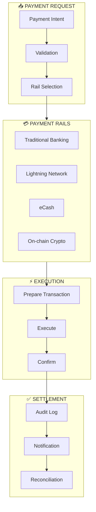
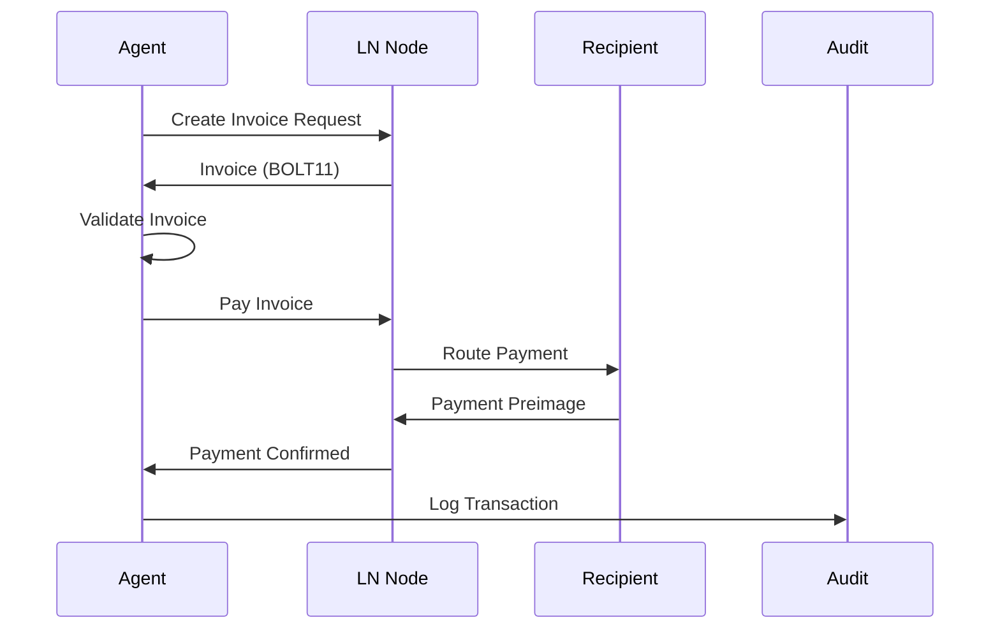
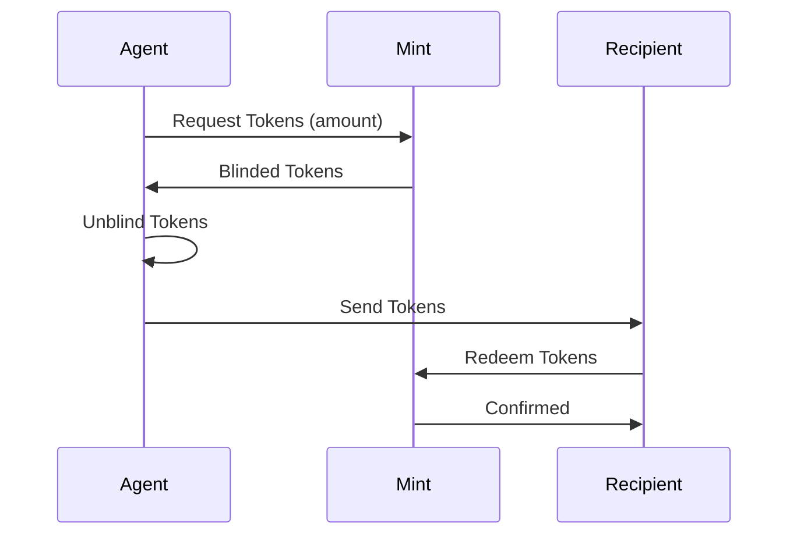

# Payment Integration Patterns

> Lightning Network, eCash, and multi-rail payment flows for AI services

## Overview

These patterns enable AI agents to handle payments across multiple rails with proper security, auditing, and reliability. Focus is on integration architecture rather than specific implementations.

## Multi-Rail Architecture



## Rail Selection Logic

### Selection Criteria
| Factor | Lightning | eCash | Traditional | On-chain |
|--------|-----------|-------|-------------|----------|
| Speed | Instant | Instant | Hours-Days | Minutes |
| Cost | Lowest | Very Low | Medium | Variable |
| Privacy | Good | Excellent | Low | Medium |
| Reversibility | No | No | Yes | No |
| Amount Limit | Medium | Low | High | High |

### Decision Flow
```python
def select_payment_rail(
    amount: Decimal,
    urgency: str,
    privacy_required: bool,
    recipient_capabilities: List[str]
) -> str:
    """Select optimal payment rail based on requirements."""

    # Filter by recipient capabilities
    available_rails = [r for r in RAILS if r in recipient_capabilities]

    if not available_rails:
        raise NoCompatibleRailError()

    # Privacy requirement
    if privacy_required:
        if "ecash" in available_rails:
            return "ecash"
        elif "lightning" in available_rails:
            return "lightning"

    # Amount-based selection
    if amount < MICROPAYMENT_THRESHOLD:
        if "lightning" in available_rails:
            return "lightning"
        elif "ecash" in available_rails:
            return "ecash"

    # Urgency-based selection
    if urgency == "immediate":
        instant_rails = ["lightning", "ecash"]
        for rail in instant_rails:
            if rail in available_rails:
                return rail

    # Default to traditional for large amounts
    if "traditional" in available_rails:
        return "traditional"

    return available_rails[0]
```

## Lightning Network Pattern

### Payment Flow


### Implementation Pattern
```python
class LightningPaymentHandler:
    """Handle Lightning Network payments."""

    def __init__(self, node_client):
        self.node = node_client
        self.pending_payments = {}

    async def pay_invoice(
        self,
        bolt11_invoice: str,
        max_fee_sats: int = 100
    ) -> PaymentResult:
        """Pay a Lightning invoice."""

        # Decode and validate invoice
        decoded = await self.node.decode_invoice(bolt11_invoice)
        self._validate_invoice(decoded)

        # Check channel liquidity
        if not await self._has_route(decoded.destination, decoded.amount):
            raise InsufficientLiquidityError()

        # Execute payment
        payment_id = str(uuid.uuid4())
        self.pending_payments[payment_id] = {
            "invoice": bolt11_invoice,
            "amount": decoded.amount,
            "status": "pending",
            "started_at": time.time()
        }

        try:
            result = await self.node.pay(
                bolt11_invoice,
                max_fee_msat=max_fee_sats * 1000,
                timeout_seconds=60
            )

            self.pending_payments[payment_id]["status"] = "completed"
            self.pending_payments[payment_id]["preimage"] = result.preimage

            return PaymentResult(
                success=True,
                payment_id=payment_id,
                preimage=result.preimage,
                fee_paid=result.fee_msat // 1000
            )

        except PaymentError as e:
            self.pending_payments[payment_id]["status"] = "failed"
            self.pending_payments[payment_id]["error"] = str(e)
            raise

    async def create_invoice(
        self,
        amount_sats: int,
        description: str,
        expiry_seconds: int = 3600
    ) -> str:
        """Create a Lightning invoice to receive payment."""

        invoice = await self.node.create_invoice(
            amount_msat=amount_sats * 1000,
            description=description,
            expiry=expiry_seconds
        )

        return invoice.bolt11
```

## eCash Pattern

### Privacy-Preserving Flow


### Implementation Pattern
```python
class ECashPaymentHandler:
    """Handle eCash payments for privacy-preserving transactions."""

    def __init__(self, mint_client):
        self.mint = mint_client
        self.wallet = ECashWallet()

    async def send_payment(
        self,
        amount: int,
        recipient_pubkey: str
    ) -> ECashPayment:
        """Send eCash payment."""

        # Check wallet balance
        if self.wallet.balance < amount:
            # Need to mint more tokens
            await self._mint_tokens(amount - self.wallet.balance)

        # Select tokens to spend
        tokens = self.wallet.select_tokens(amount)

        # Create payment token package
        payment = ECashPayment(
            tokens=tokens,
            amount=amount,
            recipient=recipient_pubkey,
            timestamp=time.time()
        )

        # Mark tokens as spent locally
        self.wallet.mark_spent(tokens)

        return payment

    async def receive_payment(
        self,
        payment: ECashPayment
    ) -> bool:
        """Receive and verify eCash payment."""

        # Verify tokens with mint
        valid = await self.mint.verify_tokens(payment.tokens)
        if not valid:
            raise InvalidTokensError()

        # Redeem tokens for fresh ones (prevent double-spend)
        new_tokens = await self.mint.swap_tokens(payment.tokens)

        # Add to wallet
        self.wallet.add_tokens(new_tokens)

        return True
```

## Audit Trail Pattern

```python
@dataclass
class PaymentAuditRecord:
    """Comprehensive payment audit record."""
    record_id: str
    timestamp: datetime
    rail: str
    direction: str  # "inbound" or "outbound"
    amount: Decimal
    currency: str
    status: str
    sender_ref: str  # Anonymized reference
    recipient_ref: str  # Anonymized reference
    fee: Optional[Decimal]
    metadata: Dict
    hash: str  # Record integrity hash

class PaymentAuditLogger:
    """Log all payments for compliance and debugging."""

    def __init__(self, storage_backend):
        self.storage = storage_backend

    def log_payment(
        self,
        rail: str,
        direction: str,
        amount: Decimal,
        **kwargs
    ) -> str:
        """Log payment with tamper-evident hash."""

        record = PaymentAuditRecord(
            record_id=str(uuid.uuid4()),
            timestamp=datetime.utcnow(),
            rail=rail,
            direction=direction,
            amount=amount,
            currency=kwargs.get("currency", "SATS"),
            status=kwargs.get("status", "pending"),
            sender_ref=self._anonymize(kwargs.get("sender")),
            recipient_ref=self._anonymize(kwargs.get("recipient")),
            fee=kwargs.get("fee"),
            metadata=kwargs.get("metadata", {}),
            hash=""
        )

        # Calculate integrity hash
        record.hash = self._calculate_hash(record)

        # Persist
        self.storage.save(record)

        return record.record_id

    def _calculate_hash(self, record: PaymentAuditRecord) -> str:
        """Calculate tamper-evident hash of record."""
        data = json.dumps({
            "record_id": record.record_id,
            "timestamp": record.timestamp.isoformat(),
            "rail": record.rail,
            "amount": str(record.amount),
            "status": record.status
        }, sort_keys=True)
        return hashlib.sha256(data.encode()).hexdigest()

    def _anonymize(self, identifier: Optional[str]) -> str:
        """Anonymize identifiers for audit storage."""
        if not identifier:
            return "unknown"
        return hashlib.sha256(identifier.encode()).hexdigest()[:16]
```

## Reconciliation Pattern

```python
class PaymentReconciler:
    """Reconcile payments across rails and systems."""

    async def daily_reconciliation(self, date: date) -> ReconciliationReport:
        """Run daily reconciliation."""

        report = ReconciliationReport(date=date)

        # Gather records from all sources
        audit_records = await self.audit.get_records(date)
        ln_transactions = await self.lightning.get_transactions(date)
        ecash_transactions = await self.ecash.get_transactions(date)

        # Match records
        for audit_record in audit_records:
            matched = False

            if audit_record.rail == "lightning":
                match = self._find_ln_match(audit_record, ln_transactions)
                if match:
                    report.matched.append((audit_record, match))
                    matched = True

            elif audit_record.rail == "ecash":
                match = self._find_ecash_match(audit_record, ecash_transactions)
                if match:
                    report.matched.append((audit_record, match))
                    matched = True

            if not matched:
                report.unmatched.append(audit_record)

        # Check for unrecorded transactions
        report.unrecorded = self._find_unrecorded(
            audit_records,
            ln_transactions + ecash_transactions
        )

        return report
```

## Security Considerations

### Rate Limiting
```python
PAYMENT_LIMITS = {
    "per_transaction": {
        "lightning": 1_000_000,  # sats
        "ecash": 100_000,
        "traditional": 10_000_00  # cents
    },
    "per_hour": {
        "lightning": 5_000_000,
        "ecash": 500_000,
        "traditional": 50_000_00
    },
    "per_day": {
        "lightning": 50_000_000,
        "ecash": 5_000_000,
        "traditional": 500_000_00
    }
}
```

### Approval Thresholds
| Amount Tier | Approval Type |
|-------------|---------------|
| Micro (<1K sats) | Auto-approve |
| Small (<100K sats) | Agent review |
| Medium (<1M sats) | Human approval |
| Large (>1M sats) | Multi-sig |

## Best Practices

### Do's
- Implement comprehensive audit logging
- Use separate keys for each rail
- Implement circuit breakers for failed payments
- Monitor channel liquidity proactively
- Reconcile daily

### Don'ts
- Don't store unencrypted keys
- Don't skip validation
- Don't ignore rate limits
- Don't log sensitive payment details
- Don't allow unlimited amounts

## Related Documentation

- [Autonomous Treasury Case Study](../case-studies/autonomous-treasury.md)
- [Self-Healing Operations](../case-studies/self-healing-ops.md)
- [Security Patterns](security-patterns.md)

---

*Payment integration enables AI agents to participate in value exchange.*
